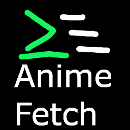

# Anime-Fetch



A neofetch-inspired utility that fetch you system info with a [OS-Tan](https://en.wikipedia.org/wiki/OS-tan)

This is a work in progress experimental cross-platfrom version of [xgui4/wpfetch](https://github.com/xgui4/wpfetch)

## Dependancy/Library needed

- GUI (Unix Like system only for now)
    - QT 6
- CLI
    - [lfreist/hwinfo](https://github.com/lfreist/hwinfo)
        - License : [MIT](LICENSE.lib.txt)
    - Curses

## Recommended System Requirement

> [!TIP] 
> There no hard requirement to use any compiler or ide, but here is official supported 
> system requirement

### For Compiling
- Unix Like System
    - Clang++ (C++ 17)
    - CMake 3.16+ (CMake 3.19+ recommended for preset)
    - HWinfo Library (installer helper available , only work on Linux thought for now)
    - QT Widget 6 (for the GUI)
- Windows System requirement
    - Visual Studio 2022 or 2026 (Community Edition)
    - CMake 3.16+ (CMake 3.19+ recommended for preset)
    - QT Widget 6 (for the GUI)
 
### For running the software
- CLI 
    - Terminal that support Sixel or Kitty protocol and Color Escape Code (support for legacy terminal coming later)
    - Kitty (for Unix like system only, won't be a hardcoded dependancy for too long)
    - Chafa (for sixel support, won't be a hardcoded dependancy for too long)
- QT GUI
    - QT 6+ (if dynamically linked)
    - A Working Display server like an X Server or Wayland (for system like GNU/Linux, not needed on MacOS or Windows) 
- General
    - hwinfo lib (if dynamically linked)

## How to Run or Install

### Unix Like System

```bash
# 1. If the library not installed yet
sudo ./install_library.sh

# 2. Build the Min Size Release with CMake (CMake Required)
cmake --build --preset MinSizeRel

# 3.
./build/publish/cli/Anime-Fetch
```

### Windows (Visual Studio with QT-tools addon)

> [!NOTE]
> Due to the complexity of the Windows Dev ecosytem, I will only show the easy way with Visual Studio and MSVC. 
> But the App should not require any binary blob to work outside of msvrt (Visual C++,  if Visual Studio is used). 

1. Install Visual Studio Community (https://visualstudio.microsoft.com/)
2. Install the QT Visual Studio Tools Addon via the Extension Store or via this link (https://marketplace.visualstudio.com/items?itemName=TheQtCompany.QtVisualStudioTools2022)
3. Install QT 6 for Windows and add it your path (there is multiple way but make sure to install the "open soure" one)
4. Set the QT Path with The QT Path 
5. Run or Debug the software via Visual Studio by the selecting either the `Anime-Fetch.exe` (CLI) or [need QT-Debug or QT-Release] `Anime-Fetch-GUI` (QT GUI)

### Helper Scripts (Installer) 

> [!WARNING]
> The Helper were a temporaly method to install the App on Unix Like System, 
> they will soon be replaced by a better method, but the removable script 
> will stay active to remove an older version of the program if installed via that script 

- `install_app.sh` : install the assets ans app in portable modes (need superuser for certain task)
- `install_library.sh`: install the lfreist/hwinfo library (need superuser priviliged)

### Windows Wizard Creation (Inno Setup) 

```Bash
GUIDE Coming Soon !
````

### Linux and *BSD Packaging

```Bash
GUIDE Coming Soon !
````

## License 

[GPLv3](LICENSE.md)

## Code Of Conduct

[Code of Respect](code-of-conduct.md)

## Credits 

[Images Credits](credits.md)
